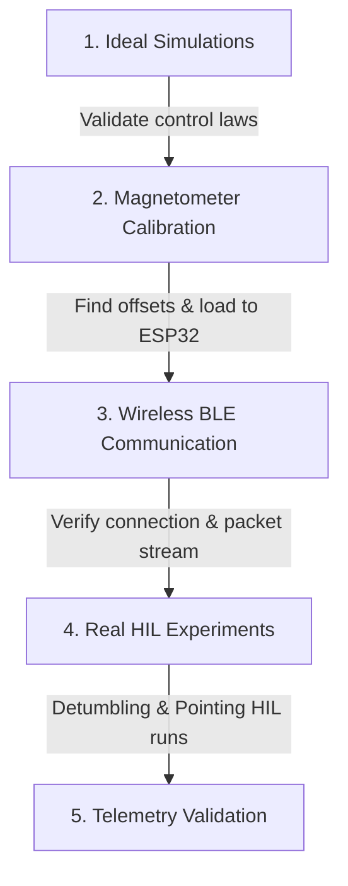

# CubeSat Attitude Determination & Control System (ADCS) User Guide

This guide explains the chronological workflow of the project, detailing how to run the theoretical simulations, perform sensor calibration, test the wireless BLE communication, and execute the final real-time Hardware-in-the-Loop (HIL) experiments.

---

## Project Chronology & Workflow

The development of the CubeSat ADCS followed a structured path:


---

## 1. Ideal Simulations (No Hardware)
**Directory**: [`1_Ideal_Simulations/`](file:///Users/bbtp/Desktop/THESIS/CUBESAT_THESI_VS/1_Ideal_Simulations/)

These files allow you to simulate the CubeSat's attitude response in a pure, noise-free Simulink environment using PD or Optimal LQR control laws.

### How to Run:
1. Open MATLAB and navigate to the `1_Ideal_Simulations/` directory.
2. Initialize the variables and gains in the workspace by running either:
   - `init_simulation_pd.m` (for the PD controller with filter parameter $N=121$)
   - `init_simulation_lqr.m` (for the Optimal LQR controller)
3. Open the corresponding Simulink model:
   - `Cubesat_Control_PD.slx`
   - `Cubesat_Control_LQR.slx`
4. Press **Run** in Simulink to view the attitude angle $\theta_z$ and control torque response.

---

## 2. Magnetometer Calibration
**Directory**: [`2_Magnetometer_Calibration/`](file:///Users/bbtp/Desktop/THESIS/CUBESAT_THESI_VS/2_Magnetometer_Calibration/)

The raw magnetometer suffers from constant magnetic biases (hard-iron distortion) generated by the CubeSat's components, shifting the measurement circle center away from $(0,0)$.

### How to Calibrate:
1. Open MATLAB and run `magnetometer_calibration.m`.
2. The script reads the raw data in `mag1.txt` (recorded during a complete 360° horizontal rotation) and computes the mean offset values:
   - $X_{\text{offset}} \approx 163$
   - $Y_{\text{offset}} \approx -57$
3. These offsets are coded into the final ESP32 firmware to perform real-time hard-iron correction:
   ```cpp
   heading = atan2((float)my + 57, (float)mx - 163) * 180.0 / PI;
   ```
4. The calibration README explains the math and circular fit.

---

## 3. Bluetooth BLE Communication
**Directory**: [`3_Bluetooth_Connection/`](file:///Users/bbtp/Desktop/THESIS/CUBESAT_THESI_VS/3_Bluetooth_Connection/)

Used to verify the wireless communication link between MATLAB and the ESP32 before running full experiments.

### How to Test Connection:
1. Make sure the ESP32 is flashed with the BLE code (or test with `BLE_Test.ino`).
2. Power on the CubeSat.
3. Open MATLAB and run the test script `Test_CubeSat_BLE_HIL.m`.
4. It will search for `ESP32_IMU`, connect, read telemetry packets, and display the parsed sensor readings (11 floats) at 10 Hz.

---

## 4. Final Real-Time HIL Experiments
**Directory**: [`4_Real_Experiment_Final/`](file:///Users/bbtp/Desktop/THESIS/CUBESAT_THESI_VS/4_Real_Experiment_Final/)

This contains the final files used in the physical HIL experiments. Telemetry is read over BLE and control commands are written back to the motor in real-time.

### Step-by-Step Execution:

#### Step 4.1: Flash the ESP32
1. Connect the ESP32 to your computer via USB.
2. Open Arduino IDE and load the project inside `CubeSat_HIL_BLE/` ([CubeSat_HIL_BLE.ino](file:///Users/bbtp/Desktop/THESIS/CUBESAT_THESI_VS/4_Real_Experiment_Final/CubeSat_HIL_BLE/CubeSat_HIL_BLE.ino)).
3. Select the correct ESP32 Board and Port, and upload the code.
4. Unplug USB and mount the satellite on the air bearing or low-friction platform, then power it up.

#### Step 4.2: Execute Detumbling (Phase 1)
1. Give the CubeSat an initial spin.
2. In MATLAB, navigate to `4_Real_Experiment_Final/` and run `MATLAB_to_BLE_DETUMBL.m`.
3. Press **Enter** to start the damping control. The script will write torque commands to damp the body angular velocity below $0.5^\circ\text{/s}$.
4. Once stabilized, the motor stops, and logs are exported to the workspace as timeseries.

#### Step 4.3: Execute Pointing Control (Phase 2)
1. In MATLAB, run `MATLAB_to_BLE_POINTING.m`.
2. The script will stop the motor, wait for the satellite to settle, and print the initial absolute sensor heading.
3. Input your target pointing angle (e.g., $45$ degrees).
4. The loop starts, calculating PID or LQR pointing torque and plotting the attitude angle tracking the reference.
5. Telemetry logs (`sensor_theta`, `sensor_omega`, `sensor_tau`) are saved and exported to the MATLAB workspace.

#### Step 4.4: Simulink Validation & Evaluation
1. Once the real-world experiment finishes, you can run the exported telemetry timeseries inside Simulink.
2. Open `PID1.slx` or `PID2.slx` which are configured to import these telemetry variables for performance comparison.
3. Run `compare_detumble.m` or `compare_pointing.m` to plot and compare results from multiple archived experiment runs.
4. Run `compare_sim_real.m` to validate the theoretical models against your physical HIL logs.

---

## Archive Folders
- [`5_Arduino_Complete_Codes/`](file:///Users/bbtp/Desktop/THESIS/CUBESAT_THESI_VS/5_Arduino_Complete_Codes/): Holds all libraries, sensor verification tests, and old Arduino trials.
- [`6_Archive_Old_Trials/`](file:///Users/bbtp/Desktop/THESIS/CUBESAT_THESI_VS/6_Archive_Old_Trials/): Stores previous MATLAB/Simulink models, compilation cache, and intermediate figures out of the active path.
